# PTY & Terminal Emulators: From First Principles

> Built from the ground up — starting with what a computer actually is, through processes and the OS, to physical terminals, and finally to the pseudo-terminal (PTY) that every modern shell session uses.

---

## Table of Contents

1. [The Computer: CPU, Memory, I/O](#1-the-computer-cpu-memory-io)
2. [The Operating System and Processes](#2-the-operating-system-and-processes)
3. [File Descriptors: Everything is a File](#3-file-descriptors-everything-is-a-file)
4. [The Problem of Input and Output](#4-the-problem-of-input-and-output)
5. [Early Computers and Human Interaction](#5-early-computers-and-human-interaction)
6. [Serial Communication and UART](#6-serial-communication-and-uart)
7. [The Physical Terminal: VT100](#7-the-physical-terminal-vt100)
8. [The Kernel TTY Subsystem](#8-the-kernel-tty-subsystem)
9. [The Line Discipline](#9-the-line-discipline)
10. [The Problem PTY Solves](#10-the-problem-pty-solves)
11. [The Pseudo Terminal (PTY)](#11-the-pseudo-terminal-pty)
12. [The Terminal Emulator](#12-the-terminal-emulator)
13. [ANSI Escape Codes and VT100 Protocol](#13-ansi-escape-codes-and-vt100-protocol)
14. [Window Size and SIGWINCH](#14-window-size-and-sigwinch)
15. [SSH: PTY Over a Network](#15-ssh-pty-over-a-network)
16. [Terminal Multiplexers and Zellij](#16-terminal-multiplexers-and-zellij)
17. [The Complete Picture](#17-the-complete-picture)

---

## 1. The Computer: CPU, Memory, I/O

A computer at its core is three things:

- **CPU** — executes instructions
- **Memory (RAM)** — holds data and instructions the CPU works on
- **I/O (Input/Output)** — everything else: disk, keyboard, screen, network, serial ports

The CPU alone is a calculator in a box. It only becomes useful when it can read data from somewhere and write results somewhere. That "somewhere" is an I/O device.

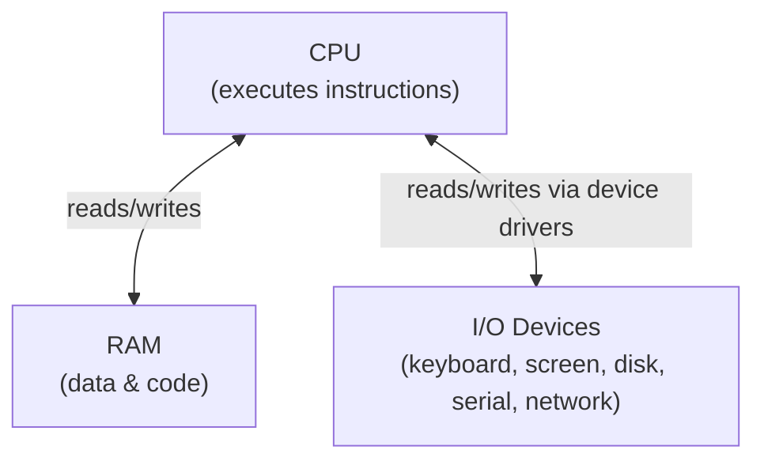

### How the CPU talks to I/O devices

Early computers used **memory-mapped I/O** or **port-mapped I/O**. In either case, the hardware (keyboard controller, serial port chip, display controller) exposes **registers** — specific memory addresses the CPU can read or write to command the hardware.

For example, to send a byte over a serial port:
1. CPU writes the byte to the UART's transmit register
2. UART hardware serializes it and sends it electrically over the wire
3. UART raises an **interrupt** when done (so CPU isn't busy-waiting)

The software that knows how to talk to specific hardware is called a **device driver**.

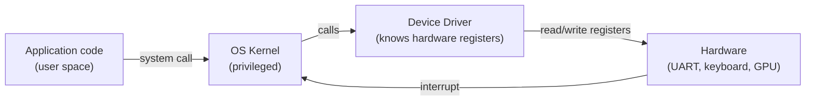

---

## 2. The Operating System and Processes

### The OS: Referee and Abstraction Layer

Without an OS, every application would need to know exactly how every piece of hardware works. This is impractical. The OS provides:

1. **Abstraction** — hide hardware complexity behind uniform interfaces
2. **Protection** — processes cannot corrupt each other's memory or the kernel
3. **Multiplexing** — share one CPU and one keyboard among many processes

### Kernel Space vs User Space

The CPU has hardware privilege levels (called **rings** on x86):

- **Ring 0 (kernel mode)** — full access to hardware, all instructions allowed
- **Ring 3 (user mode)** — restricted; cannot access hardware directly, cannot run privileged instructions

Application code runs in ring 3. To do anything privileged (like writing to a file, or sending bytes over a serial port), the application makes a **system call** — a controlled entry point into the kernel.

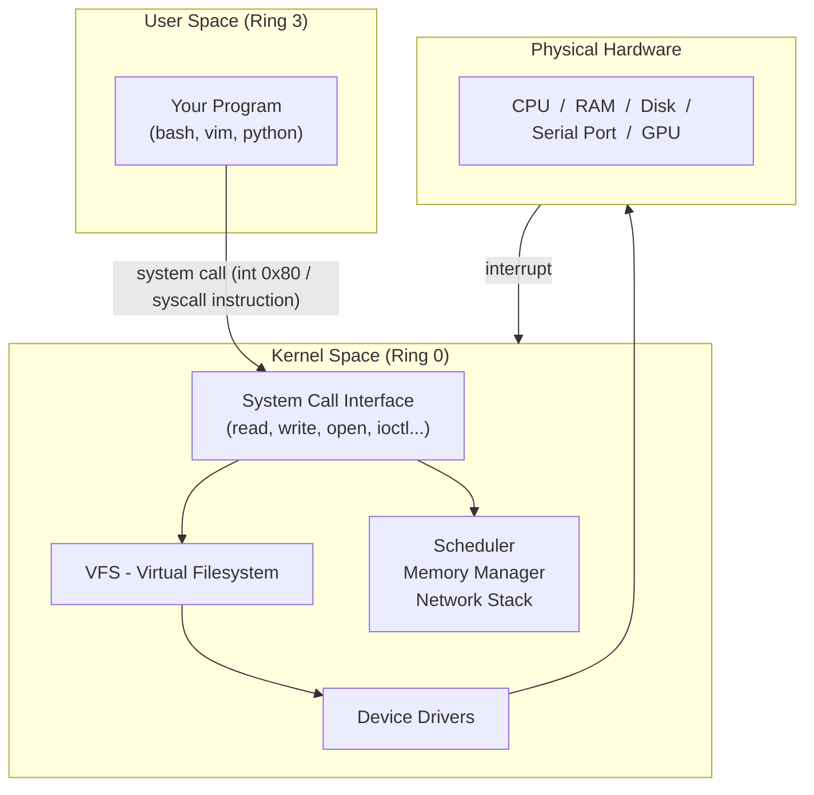

### Processes

A **process** is a running program. The OS creates a process by:
1. Loading the program's binary from disk into RAM
2. Allocating a stack and heap
3. Setting the instruction pointer to the entry point
4. Scheduling it on the CPU

Every process has:
- A **PID** (process ID)
- A **virtual address space** (the process thinks it owns all of RAM — the OS translates using page tables)
- A set of **open file descriptors**
- A **current working directory**
- **Environment variables**
- A **controlling terminal** (we'll come back to this)

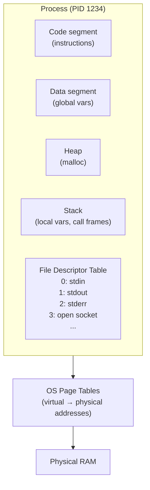

---

## 3. File Descriptors: Everything is a File

One of Unix's most profound design decisions: **everything is a file**.

A **file descriptor** (fd) is just a small integer — an index into the process's file descriptor table. Each entry points to a kernel object that the process can `read()` and `write()` using the exact same system calls, regardless of what the thing actually is:

| fd | Might point to |
|----|----------------|
| 0  | stdin (keyboard, or a pipe, or a file) |
| 1  | stdout (screen, or a pipe, or a file) |
| 2  | stderr (screen, or a file) |
| 3  | A regular file on disk |
| 4  | A network socket |
| 5  | A TTY device (`/dev/tty1`) |
| 6  | A PTY master (`/dev/ptmx`) |
| 7  | A pipe read end |

The key insight: **a process writing to fd 1 doesn't know or care if that goes to a screen, a file, a socket, or a pipe.** The kernel routes it correctly. This is why shell redirection works:

```sh
# Both commands write to fd 1; shell just changes where fd 1 points
ls                    # fd 1 → /dev/tty (screen)
ls > output.txt       # fd 1 → output.txt (disk file)
ls | grep foo         # fd 1 → write end of a pipe
```

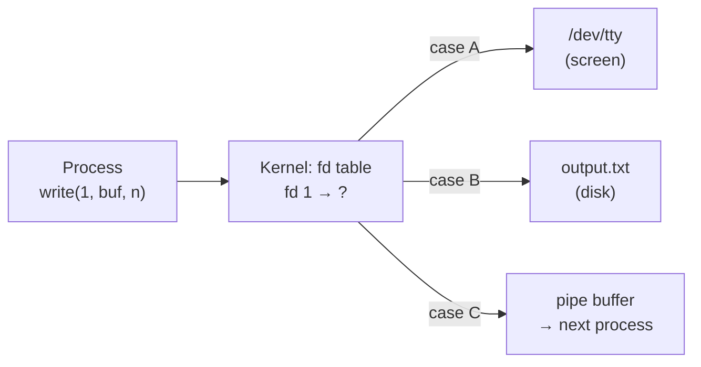

---

## 4. The Problem of Input and Output

Before we had screens and keyboards as we know them, "input/output" meant something very different. Understanding this history explains why terminals work the way they do.

The evolution:
1. **Punched cards / paper tape** — batch processing, no interactive I/O
2. **Teletypes (TTY)** — electromechanical typewriters connected to computers
3. **Video terminals (VT)** — replaced the teletype paper roll with a screen
4. **Personal computers** — keyboard and screen built in, but software still inherited the terminal abstraction
5. **Terminal emulators** — software that pretends to be a video terminal inside a window

Each step built on the previous one. Unix was designed when step 2→3 was happening, which is why the abstractions it created still shape every shell session today.

---

## 5. Early Computers and Human Interaction

### The Teletype (TTY) Era — 1940s to 1970s

A **teletype** (TTY) was an electromechanical machine — essentially an electric typewriter that could send and receive text over a wire. The military and news agencies used them for decades before computers existed.

When computers arrived, teletypes became the natural interface:

```
Operator types on keyboard
  → electrical signal sent over wire
    → computer receives character
      → computer sends character back ("echo")
        → teletype prints character on paper roll
```

The operating system treated the teletype connection as a **character device**. Characters flowed one at a time in both directions. There was no concept of a "cursor" or "screen" — just a continuous paper roll advancing downward.

Key consequences that are still with us today:
- **Line buffering**: The OS collected characters until you pressed **Enter** (Return/Carriage Return). This avoided sending each keystroke separately over a slow line. This is why `read()` on stdin blocks until Enter by default.
- **Echo**: The computer echoed back what you typed so it appeared on the paper. The teletype itself wasn't printing what you pressed — the computer was.
- **Control characters**: `Ctrl+C` (character code 3) meant "interrupt". `Ctrl+D` (code 4) meant "end of input". These were conventions from teletype days and persist in Unix today.
- **`\r\n` (Carriage Return + Line Feed)**: On a real teletype, `\r` moved the print head to the left margin; `\n` advanced the paper one line. You needed both. Unix internally uses only `\n`, but the TTY layer translates.

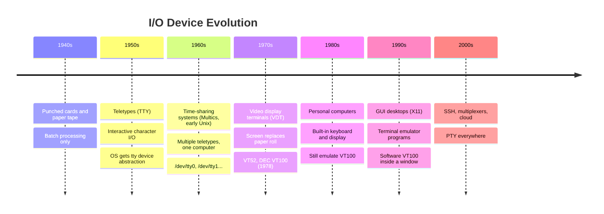

---

## 6. Serial Communication and UART

### What is "Serial" Communication?

Computers move data internally in parallel — many bits at once on a wide bus. But wires are expensive. Serial communication sends bits **one at a time** over a single wire pair.

**UART** (Universal Asynchronous Receiver-Transmitter) is the hardware chip that handles this conversion:
- On the send side: takes a byte (8 bits in parallel from the CPU) and sends each bit one at a time
- On the receive side: collects incoming bits and assembles them into bytes for the CPU

"Asynchronous" means sender and receiver don't share a clock signal. Instead, they agree in advance on a **baud rate** (bits per second). The UART uses start/stop bits to frame each byte.

```
One byte (e.g., 'A' = 0x41 = 01000001) sent at 9600 baud:

Wire:  ___     ___ ___ ___         ___ ___
      |   |   |   |   |   |___ ___|   |   |___
      START  b0  b1  b2  b3  b4  b5  b6  b7  STOP
           (LSB first)
```

**RS-232** was the standard connector and voltage standard for serial communication — the 9-pin or 25-pin port on older PCs. Terminals plugged into computers via RS-232.

### How the Kernel Sees the UART

The kernel has a **UART driver** that:
1. Programs the UART chip with baud rate, data bits, parity
2. Registers an **interrupt handler** for received characters
3. When a character arrives: interrupt fires → driver reads byte from UART register → puts it in a buffer → notifies the TTY layer

The TTY layer is the next abstraction up — it sits between the raw UART driver and the processes.

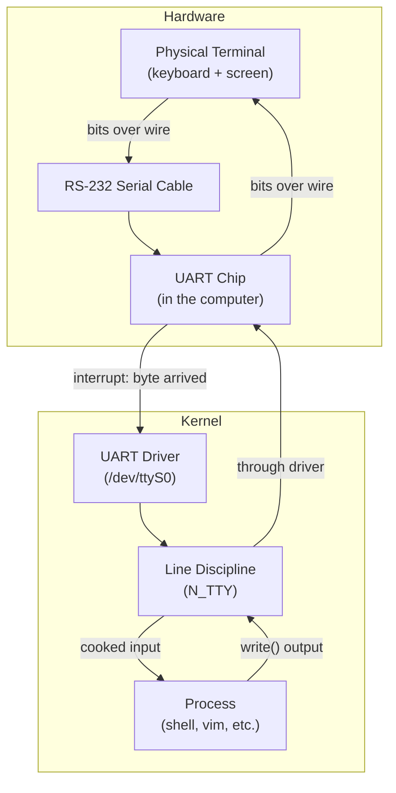

---

## 7. The Physical Terminal: VT100

### What is a Video Terminal?

By the late 1970s, teletypes were replaced by **video display terminals (VDTs)** — devices with a screen (CRT) and a keyboard, connected to a computer over a serial cable.

The most influential was the **DEC VT100** (Digital Equipment Corporation, 1978). It became so standard that "VT100 compatible" is still what terminal emulators claim to be today.

### What a Physical Terminal Actually Does

A terminal is really just two things:
1. **Keyboard scanner**: Detects key presses, encodes them as bytes, sends them over the serial line
2. **Display controller**: Receives bytes over the serial line, interprets them, and updates the screen

The terminal has its **own CPU and firmware**. It's not just a dumb cable — it has logic to:
- Maintain a grid of character cells (e.g., 80 columns × 24 rows)
- Parse incoming bytes as either printable characters or **escape sequences** (control codes)
- Move the cursor, clear lines, change colors based on escape sequences
- Handle its own screen refresh (drawing characters onto the CRT)

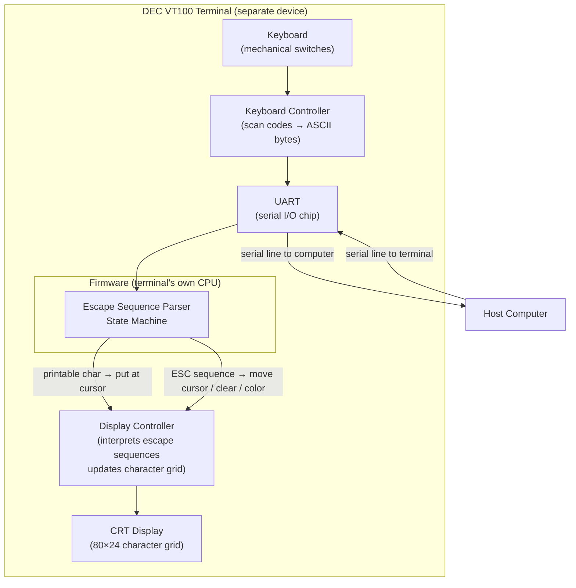

### Escape Sequences: Why They Exist

A terminal receives a stream of bytes. Most bytes are printable characters — just put them on the screen at the cursor position and advance the cursor. But what about moving the cursor? Changing color? Clearing the screen?

There's no extra wire for "cursor up." It all has to travel as bytes on the same serial line. The solution: **escape sequences** — special byte sequences that begin with the **ESC character** (byte `0x1B`, decimal 27).

When the terminal's firmware sees `0x1B`, it switches from "display this character" mode to "interpret a command" mode:

```
Bytes received: H e l l o ESC [ A W o r l d
                ^^^^^^^^^^ ^^^^^^^^^^^^ ^^^^^^^^^^^^^^
                Print       Cursor Up    Print
                "Hello"     (ESC [ A)    "World"
```

The VT100 defined a specific set of escape sequences. This is the origin of **ANSI escape codes** — formalized in ANSI standard X3.64, now called **VT100/VT102 compatible**.

---

## 8. The Kernel TTY Subsystem

### The Problem of Multiple Terminals

Early Unix time-sharing systems had many physical terminals plugged in. Each needed:
- Its own UART device file (`/dev/tty1`, `/dev/ttyS0`, etc.)
- A login process waiting for input
- Correct routing of output back to the right terminal

The kernel needed a **TTY subsystem** to manage all of this.

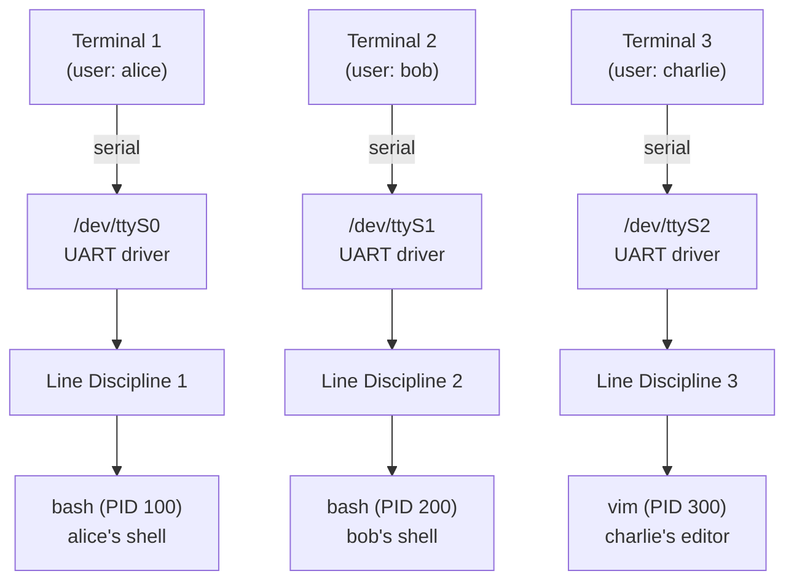

### The Controlling Terminal

Every process has a **controlling terminal** — the TTY device it's associated with. This is how the kernel knows which process group to send `SIGINT` to when you press `Ctrl+C`.

You can find your controlling terminal:
```sh
$ tty
/dev/pts/3      # a PTY slave (more on this later)

$ ls -la /proc/self/fd/0
lrwxrwxrwx 1 user user 0 ... /proc/self/fd/0 -> /dev/pts/3
```

The controlling terminal is set when a process calls `setsid()` to create a new session, then opens a TTY device — that device becomes the controlling terminal for the whole session.

### TTY Device Files

The kernel exposes each terminal as a character device under `/dev/`:

| Path | Meaning |
|------|---------|
| `/dev/ttyS0` | First hardware serial port (RS-232) |
| `/dev/tty1` | First virtual console (Ctrl+Alt+F1) |
| `/dev/console` | System console |
| `/dev/tty` | The calling process's controlling terminal |
| `/dev/pts/N` | PTY slave (pseudo terminal, explained later) |

---

## 9. The Line Discipline

### What is the Line Discipline?

Between the raw UART driver and the process lies a crucial software layer: the **line discipline**.

The line discipline is a kernel module that implements **smart buffering and processing** of the character stream. It's what makes terminals feel interactive and useful. The default line discipline for terminals is called **N_TTY**.

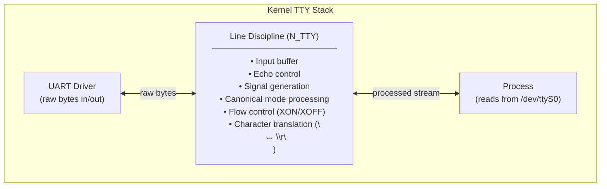

### What the Line Discipline Does

**1. Echo**

When you type on a real terminal, the computer receives the keystroke and echoes it back. The terminal displays what the computer sends back, not what you pressed. The line discipline handles this echoing:

```
[you press 'h']
  → UART driver receives byte 0x68 ('h')
    → Line discipline: add to input buffer, write 'h' back to UART (echo)
      → UART sends 'h' to terminal
        → terminal displays 'h' on screen
```

**2. Canonical Mode (Cooked Mode)**

By default, the line discipline is in **canonical mode**. In this mode:
- Input is collected into a line buffer
- The buffer is not delivered to the process until the user presses **Enter** (`\n`)
- Basic line editing works within the buffer: `Backspace` deletes the last character, `Ctrl+U` kills the whole line, `Ctrl+W` kills the last word
- The process gets a complete line at a time

This is why `cat` or `grep` wait for Enter before doing anything — they're blocked in `read()` waiting for the line discipline to deliver a complete line.

**3. Raw Mode (Non-Canonical Mode)**

Programs like `vim`, `htop`, `bash` (when doing tab completion) need to react to individual keystrokes immediately. They switch the terminal to **raw mode** by calling `tcsetattr()`:

```c
struct termios t;
tcgetattr(STDIN_FILENO, &t);     // get current settings
t.c_lflag &= ~(ICANON | ECHO);  // disable canonical mode and echo
tcsetattr(STDIN_FILENO, TCSANOW, &t);  // apply immediately
```

In raw mode:
- Every keystroke is delivered to the process immediately
- No echoing (the application handles its own display)
- No line buffering
- The application reads arrow keys, function keys, etc. as escape sequences

**4. Signal Generation**

The line discipline watches for special characters and generates signals:

| Character | Byte | Signal | Default action |
|-----------|------|--------|----------------|
| `Ctrl+C` | `0x03` | SIGINT | Interrupt (terminate) |
| `Ctrl+Z` | `0x1A` | SIGTSTP | Stop (suspend to background) |
| `Ctrl+\` | `0x1C` | SIGQUIT | Quit (core dump) |
| `Ctrl+D` | `0x04` | *(EOF)* | End of file (no signal) |

This is why `Ctrl+C` works in any program — it doesn't matter if the program handles signals or not. The **kernel TTY line discipline** generates SIGINT and sends it to the process group.

**5. Character Translation**

Terminals use `\r\n` (carriage return + line feed) for new lines. Unix uses just `\n`. The line discipline translates:
- **Input**: `\r` → `\n` (what you press maps to what the program receives)
- **Output**: `\n` → `\r\n` (what the program sends maps to what the terminal displays)

### Termios: The API for Configuring the Line Discipline

`termios` is the C structure that holds all line discipline settings:

```c
struct termios {
    tcflag_t c_iflag;   // input flags (echo, signal generation, translation)
    tcflag_t c_oflag;   // output flags (newline translation, postprocessing)
    tcflag_t c_cflag;   // control flags (baud rate, parity, stop bits)
    tcflag_t c_lflag;   // local flags (canonical mode, echo, signals)
    cc_t     c_cc[NCCS]; // special characters (EOF, INTR, QUIT, ERASE, KILL...)
};
```

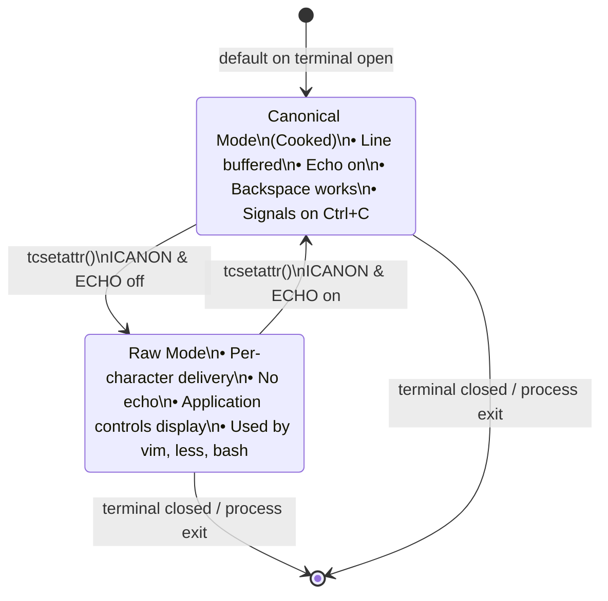

---

## 10. The Problem PTY Solves

### The World Changes

Everything described so far works perfectly when there's a real physical terminal connected via a serial cable. But by the 1980s and 1990s, two things happened that broke this model:

**Problem 1: Remote access over a network (SSH/rlogin)**

You want to log into a remote Unix machine from your local machine over a network. The network is not a serial cable. There's no UART on the remote machine connected to your keyboard and screen. But the remote shell and its programs still expect to be connected to a TTY — they call `isatty()`, they want `Ctrl+C` to work, they want to set raw mode via `tcsetattr()`.

**Problem 2: Terminal emulators in a graphical desktop (X11)**

You're running a GUI (like X11 or a modern desktop). You want to open a terminal window (like xterm, gnome-terminal, etc.). This is a window — a graphical rectangle on screen. But the shell inside it still expects a TTY. How do you connect a window to the TTY subsystem?

In both cases, you need something that **looks like a TTY to the kernel and to processes, but is actually controlled by a program** (the SSH daemon, or the terminal emulator GUI).

That something is the **Pseudo Terminal (PTY)**.

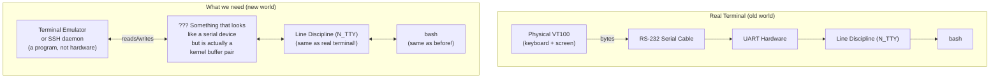

---

## 11. The Pseudo Terminal (PTY)

### What a PTY Is

A PTY is a **kernel-provided pair of file descriptors** that are connected back-to-back through the kernel's TTY subsystem:

- **PTY Master** (`/dev/ptmx`): The "outside" end. A program (terminal emulator, SSH daemon) opens this. Whatever the master writes appears as input on the slave. Whatever the slave's process writes comes out on the master for reading.
- **PTY Slave** (`/dev/pts/N`): The "inside" end. The shell and its child programs use this. To them, it looks and behaves exactly like `/dev/ttyS0` — a real serial terminal. It has a line discipline, responds to `tcsetattr()`, sends signals on `Ctrl+C`, etc.

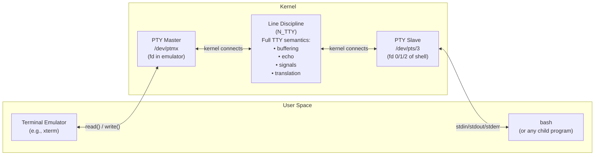

### The Critical Insight

The PTY slave is a **real TTY device** with a **real line discipline**. The shell has no idea it's connected to a PTY instead of a physical terminal. It calls `tcsetattr()` to switch to raw mode — that works. It calls `isatty(0)` to check if stdin is a terminal — that returns true. `Ctrl+C` generates SIGINT — that works. Window size reporting — that works.

Everything the shell and its programs expect from a terminal is provided by the PTY slave's line discipline, exactly as if a VT100 were connected on the other end.

The terminal emulator, holding the master end, is **playing the role that the physical terminal hardware used to play**:
- User input (keyboard events) → convert to bytes → write to master → flows through line discipline → shell reads it
- Shell output → write to slave → flows through line discipline → comes out on master → emulator reads it → renders on screen

### PTY Data Flow

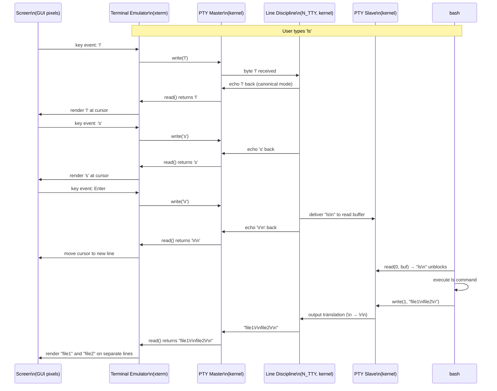

### Opening a PTY: The System Calls

Here is the complete sequence a terminal emulator performs when it starts:

```c
#include <stdlib.h>
#include <fcntl.h>
#include <unistd.h>

// Step 1: Open the PTY master device
int master_fd = posix_openpt(O_RDWR | O_NOCTTY);
// master_fd is now our handle to the PTY master

// Step 2: Grant access to the slave device
grantpt(master_fd);

// Step 3: Unlock the slave device
unlockpt(master_fd);

// Step 4: Get the slave device path (e.g., "/dev/pts/5")
char *slave_path = ptsname(master_fd);

// Step 5: Fork — create child process
pid_t pid = fork();

if (pid == 0) {
    // === CHILD PROCESS (will become the shell) ===

    // Step 6: Create a new session (detach from parent's controlling terminal)
    setsid();

    // Step 7: Open the slave end — this makes it our controlling terminal
    int slave_fd = open(slave_path, O_RDWR);

    // Step 8: Make slave fd 0, 1, 2 (stdin, stdout, stderr)
    dup2(slave_fd, STDIN_FILENO);
    dup2(slave_fd, STDOUT_FILENO);
    dup2(slave_fd, STDERR_FILENO);

    // Close original slave_fd (we have it as 0, 1, 2 now)
    if (slave_fd > 2) close(slave_fd);
    close(master_fd); // child doesn't need master

    // Step 9: Exec the shell
    execl("/bin/bash", "bash", NULL);

} else {
    // === PARENT PROCESS (the terminal emulator) ===
    // master_fd is our connection to the shell's terminal
    // Read from master_fd to get shell output
    // Write to master_fd to send keystrokes to shell
    run_event_loop(master_fd);
}
```

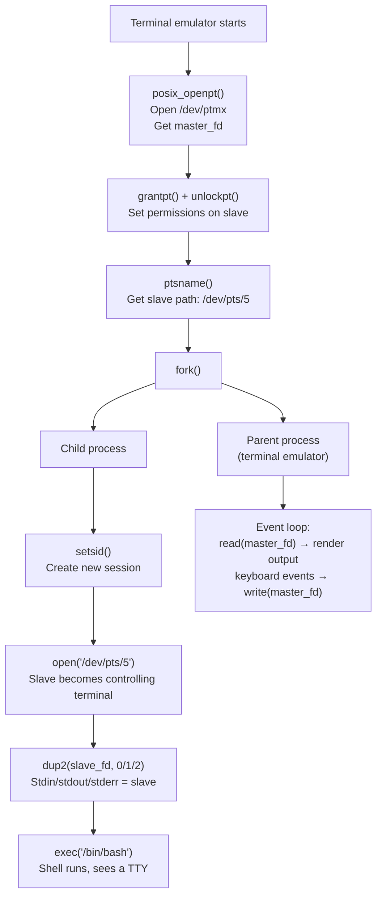

---

## 12. The Terminal Emulator

### What a Terminal Emulator Is

A terminal emulator is a program that:
1. Opens a PTY master (as shown above)
2. Creates a window on screen
3. Runs a shell (or other program) with the PTY slave as its terminal
4. **Renders output**: reads bytes from the PTY master and interprets them — plain characters go into a character grid, escape sequences move the cursor, change colors, etc.
5. **Forwards input**: captures keyboard events from the window system and writes the appropriate bytes to the PTY master

The terminal emulator must contain an **escape sequence parser** — a state machine that reads the byte stream from the shell and understands VT100/ANSI codes.

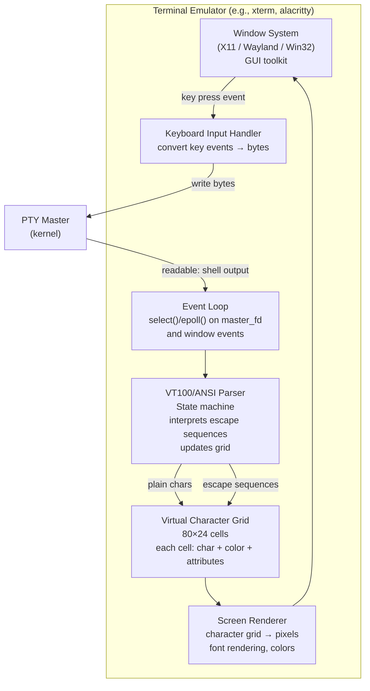

### The Character Grid

The terminal emulator maintains a 2D grid of cells. Each cell stores:
- A Unicode character (or space)
- Foreground color
- Background color
- Attributes: bold, italic, underline, blink, reverse video

When the shell writes to stdout, the bytes flow through the PTY and arrive on the master. The emulator's parser processes them:
- Printable ASCII / UTF-8: place at current cursor position, advance cursor
- `\r` (0x0D): move cursor to column 0
- `\n` (0x0A): move cursor down one row (and scroll if at bottom)
- `ESC [` (0x1B 0x5B): begin a **CSI escape sequence** — read more bytes to complete the command

---

## 13. ANSI Escape Codes and VT100 Protocol

### The Byte Stream is Both Data and Commands

Programs write to stdout using `write()`. The bytes flow through the PTY slave → line discipline → PTY master → terminal emulator. The emulator must distinguish:
- Bytes that are characters to display: just put them in the grid
- Bytes that are control commands: interpret and act on them

The distinction is made by the **ESC character** (0x1B). An ESC followed by `[` (0x5B) is a **Control Sequence Introducer (CSI)**. What follows is a sequence of parameters and a final command byte.

### Common ANSI/VT100 Escape Sequences

```
ESC [ Pn ; Pn ... cmd
  │   │  └─────────── Parameters (numbers separated by semicolons)
  │   └────────────── '[' = CSI (Control Sequence Introducer)
  └────────────────── ESC = 0x1B
                  │
                  └── Command letter (A/B/C/D for cursor, H for position, m for color...)
```

| Sequence | Meaning |
|----------|---------|
| `ESC[A` | Cursor up 1 row |
| `ESC[B` | Cursor down 1 row |
| `ESC[C` | Cursor forward 1 column |
| `ESC[D` | Cursor back 1 column |
| `ESC[H` | Cursor home (0,0) |
| `ESC[2J` | Clear entire screen |
| `ESC[K` | Clear to end of line |
| `ESC[1;24H` | Move cursor to row 1, column 24 |
| `ESC[31m` | Set foreground color to red |
| `ESC[1;32m` | Bold + green foreground |
| `ESC[0m` | Reset all attributes |
| `ESC[?25h` | Show cursor |
| `ESC[?25l` | Hide cursor |
| `ESC[?1049h` | Enter alternate screen buffer |
| `ESC[?1049l` | Leave alternate screen buffer |

### The Parser State Machine

The terminal emulator's parser is a state machine. It processes one byte at a time:

```mermaid
stateDiagram-v2
    [*] --> Ground

    Ground: Ground\n(normal character display)
    Escape: Escape\n(saw ESC 0x1B)
    CSI: CSI Entry\n(saw ESC [)
    CSI_Param: CSI Param\n(reading numbers)
    OSC: OSC\n(saw ESC ])
    String: String\n(inside OSC or DCS)

    Ground --> Escape: 0x1B (ESC)
    Ground --> Ground: printable → draw char at cursor

    Escape --> CSI: '[' (0x5B)
    Escape --> OSC: ']' (0x5D)
    Escape --> Ground: other → execute escape command

    CSI --> CSI_Param: 0-9 or ';'
    CSI_Param --> CSI_Param: 0-9 or ';' (accumulate params)
    CSI_Param --> Ground: final byte (letter) → execute CSI command
    CSI --> Ground: final byte (letter) → execute CSI command

    OSC --> String: any character
    String --> Ground: BEL (0x07) or ST (ESC \)
```

### Example: `ls --color` output

When `ls --color` outputs colored filenames, it writes sequences like:

```
ESC[1;34mDocuments ESC[0m
```

The terminal emulator parses this as:
1. `ESC[1;34m` → CSI command `m` (SGR - Select Graphic Rendition), params `1` (bold) and `34` (blue foreground) → set current color to bold blue
2. `Documents` → 9 printable characters → draw each in the grid with current bold-blue color
3. `ESC[0m` → CSI command `m`, param `0` → reset all colors to default

The result: "Documents" appears bold and blue on screen.

---

## 14. Window Size and SIGWINCH

### How Does the Shell Know the Terminal Size?

Programs like `vim`, `htop`, and `bash` itself need to know the terminal dimensions (rows and columns) to lay out their display correctly.

The terminal size is stored in the PTY as a kernel structure:

```c
struct winsize {
    unsigned short ws_row;    // rows, in characters
    unsigned short ws_col;    // columns, in characters
    unsigned short ws_xpixel; // horizontal size, in pixels (optional)
    unsigned short ws_ypixel; // vertical size, in pixels (optional)
};
```

The terminal emulator sets this with `ioctl()` on the master fd:

```c
struct winsize ws = { .ws_row = 24, .ws_col = 80 };
ioctl(master_fd, TIOCSWINSZ, &ws);
```

The kernel:
1. Stores the new size in the PTY
2. Sends **SIGWINCH** (Signal Window CHange) to the foreground process group

Programs that care about window size (vim, htop) catch SIGWINCH and re-query the size:

```c
signal(SIGWINCH, handle_resize);

void handle_resize(int sig) {
    struct winsize ws;
    ioctl(STDOUT_FILENO, TIOCGWINSZ, &ws);
    // ws.ws_row and ws.ws_col now have new dimensions
    // Redraw the UI
}
```

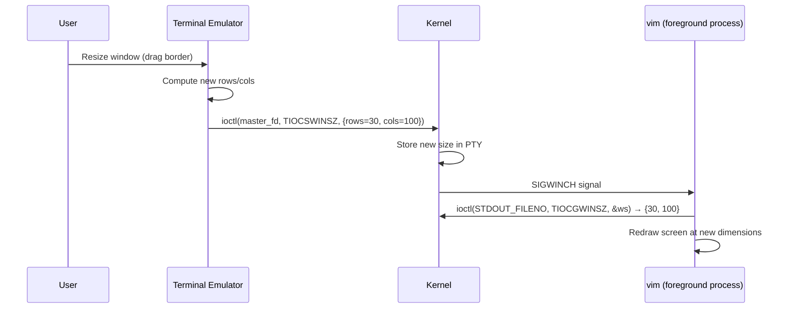

---

## 15. SSH: PTY Over a Network

### The Challenge

When you `ssh user@remote-host`, you want an interactive shell session on the remote machine. The remote shell needs a TTY. But your local keyboard and screen are connected to your **local** machine's terminal, not the remote machine's hardware.

### How SSH Uses PTY

SSH allocates a PTY on the **remote** machine:

1. Local SSH client sends "please allocate a PTY" request to remote SSH daemon
2. Remote `sshd` opens a PTY pair on the remote machine
3. Remote `sshd` forks a shell with the PTY slave as its controlling terminal
4. Data flows: keyboard → local terminal → local ssh client → encrypted network channel → remote sshd → PTY master → line discipline → PTY slave → remote shell

```mermaid
graph LR
    subgraph LocalMachine["Your Local Machine"]
        KB["Keyboard / Screen"]
        TERM_EMU["Terminal Emulator\n(xterm, etc.)"]
        LOCAL_PTY["Local PTY\nmaster/slave"]
        SSH_CLIENT["ssh client"]
    end

    NET["🌐 Network\n(encrypted SSH tunnel)"]

    subgraph RemoteMachine["Remote Server"]
        SSHD["sshd\n(daemon)"]
        REMOTE_MASTER["PTY Master\n(held by sshd)"]
        LD["Line Discipline\n(N_TTY)"]
        REMOTE_SLAVE["PTY Slave\n(/dev/pts/7)"]
        BASH["bash\n(remote shell)"]
    end

    KB --> TERM_EMU
    TERM_EMU <-->|"PTY bytes"| LOCAL_PTY
    LOCAL_PTY <-->|"stdin/stdout"| SSH_CLIENT
    SSH_CLIENT <-->|"encrypted TCP"| NET
    NET <-->|"encrypted TCP"| SSHD
    SSHD <-->|"read/write master"| REMOTE_MASTER
    REMOTE_MASTER <-->|"kernel"| LD
    LD <-->|"kernel"| REMOTE_SLAVE
    REMOTE_SLAVE <-->|"stdin/stdout/stderr"| BASH
```

### The `TERM` Environment Variable

When SSH allocates the PTY, it copies your **local** `$TERM` environment variable to the remote session. This tells remote programs what kind of terminal you have — which escape sequences it understands.

```sh
$ echo $TERM
xterm-256color   # 256-color xterm-compatible terminal
```

Remote `vim` or `htop` reads `$TERM` to know which terminfo database entry to use, so it sends the right escape sequences for your terminal.

---

## 16. Terminal Multiplexers and Zellij

### The Problem Multiplexers Solve

A terminal emulator gives you one shell in one window. But you often want:
- Multiple panes/windows in one terminal
- Sessions that survive disconnection (you can detach and reattach)
- Shared sessions (multiple users watching the same terminal)

Terminal multiplexers (`tmux`, `screen`, `Zellij`) solve this by inserting **another layer of PTYs**.

### How Zellij Works

Zellij acts as both a **terminal** (to the programs running inside panes) and a **program** (to the outer terminal emulator):

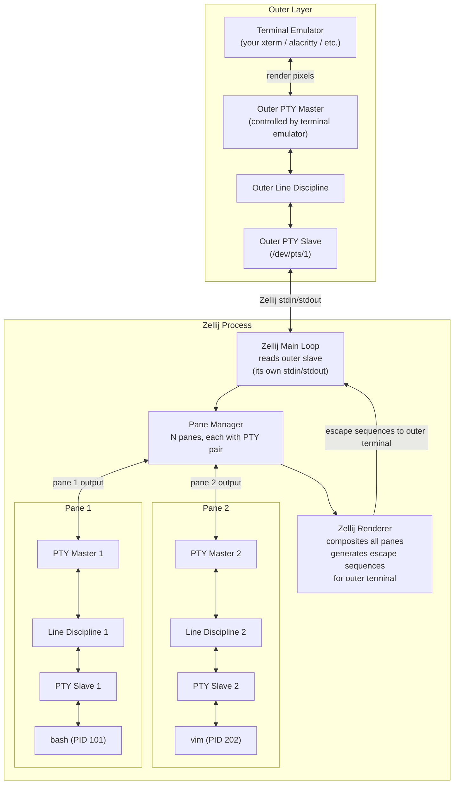

### What Zellij Actually Does

1. **Opens N PTY pairs** — one per pane
2. **For each pane**: forks a shell with the PTY slave as its controlling terminal
3. **Reads from each PTY master**: receives the shell's output (escape sequences and text)
4. **Maintains a virtual grid per pane**: parses the shell output using a built-in VT100 parser
5. **Composites the panes**: arranges virtual grids into the screen layout
6. **Renders to the outer terminal**: generates escape sequences that draw the composite layout in the outer terminal emulator

This is why Zellij's `zellij-server/src/pty.rs` handles PTY creation and management, while `zellij-utils` contains the VT grid/parser logic.

### The Detach/Reattach Mechanism

When you detach from Zellij (press the detach key), the Zellij server process keeps running on the machine. It still holds the PTY masters — the shells inside the panes are completely unaffected. The PTY slave/master pairs (and thus the shells) exist independently of any outer terminal.

When you reattach, a new Zellij client process opens a new outer PTY connection to the server, and the server starts rendering to it again. The shells never knew you left.

---

## 17. The Complete Picture

Putting all layers together, here is what happens when you type a command in a Zellij pane on a remote machine over SSH:

```mermaid
graph TB
    subgraph Physical["Physical Layer"]
        FINGERS["Your fingers"]
        KEYS["Physical keyboard\n(USB HID)"]
        PIXELS["Monitor pixels"]
    end

    subgraph LocalOS["Local OS"]
        KD["Keyboard driver\n(USB HID → key codes)"]
        WS["Window system\n(Wayland / X11)"]
        LTERM["Terminal emulator\n(alacritty / gnome-terminal)"]
        LMASTER["Local PTY master\n(kernel)"]
        LLD["Local line discipline"]
        LSLAVE["Local PTY slave\n(kernel)"]
        LSSH["ssh client process\n(stdin/stdout = local PTY slave)"]
    end

    subgraph Network["Network"]
        TLS["TLS-encrypted TCP\nport 22"]
    end

    subgraph RemoteOS["Remote OS"]
        RSSHD["sshd daemon"]
        RMASTER["Remote PTY master\n(kernel)"]
        RLD["Remote line discipline"]
        RSLAVE["Remote PTY slave\n(kernel)"]
        ZELLIJ["Zellij server\n(stdin/stdout = remote PTY slave)"]
        ZMASTER["Pane PTY master\n(kernel)"]
        ZLD["Pane line discipline"]
        ZSLAVE["Pane PTY slave\n(kernel)"]
        BASH["bash (in pane)"]
    end

    FINGERS --> KEYS --> KD --> WS --> LTERM
    LTERM -->|"key bytes → write()"| LMASTER
    LMASTER <--> LLD <--> LSLAVE
    LSLAVE -->|"stdin"| LSSH
    LSSH -->|"encrypt + send"| TLS
    TLS -->|"receive + decrypt"| RSSHD
    RSSHD -->|"write()"| RMASTER
    RMASTER <--> RLD <--> RSLAVE
    RSLAVE -->|"stdin"| ZELLIJ
    ZELLIJ -->|"route to pane write()"| ZMASTER
    ZMASTER <--> ZLD <--> ZSLAVE
    ZSLAVE -->|"stdin (fd 0)"| BASH

    BASH -->|"stdout write()"| ZSLAVE
    ZSLAVE --> ZLD --> ZMASTER
    ZMASTER -->|"read()"| ZELLIJ
    ZELLIJ -->|"parse + composite\nwrite escape sequences"| RSLAVE
    RSLAVE --> RLD --> RMASTER
    RMASTER -->|"read()"| RSSHD
    RSSHD -->|"encrypt + send"| TLS
    TLS -->|"receive + decrypt"| LSSH
    LSSH -->|"stdout"| LSLAVE
    LSLAVE --> LLD --> LMASTER
    LMASTER -->|"read()"| LTERM
    LTERM -->|"parse VT100\nrender to grid\ndraw pixels"| PIXELS
```

### Summary of Key Concepts

| Concept | What it is | Why it exists |
|---------|-----------|---------------|
| **UART** | Hardware chip for serial communication | Physical mechanism to send bytes over a wire |
| **RS-232** | Voltage standard for serial cables | Connect terminals to computers |
| **TTY** | Teletype; became generic term for any terminal | Historical name, now means any terminal device |
| **VT100** | Standard physical video terminal (1978) | Defined escape sequences everyone still uses |
| **Line discipline** | Kernel layer between driver and process | Provides echo, buffering, signal generation |
| **Canonical mode** | Line-buffered input with kernel editing | Sensible default for reading lines of text |
| **Raw mode** | Per-character delivery, no echo | Full-screen programs (vim, htop) need it |
| **`termios`** | C API to configure line discipline | Change mode, special characters, etc. |
| **PTY master** | Kernel fd held by terminal emulator | Emulator reads shell output, writes keyboard input |
| **PTY slave** | Kernel fd held by shell | Shell's stdin/stdout/stderr; looks like a real TTY |
| **ANSI escape codes** | Byte sequences beginning with ESC | Control cursor, colors, without extra wires |
| **Terminal emulator** | Program that plays the role of physical terminal | Display shells in GUI windows |
| **SIGWINCH** | Signal sent when window is resized | Programs can re-layout their display |
| **SSH PTY** | PTY allocated on remote machine | Remote shells have TTY semantics over network |
| **Multiplexer** | Program holding N PTY pairs, routing to one outer PTY | Multiple panes, session persistence |

---

## Further Reading

- [The TTY Demystified](https://www.linusakesson.net/programming/tty/) — Linus Åkesson (essential reading)
- [POSIX terminal interface](https://pubs.opengroup.org/onlinepubs/9699919799/basedefs/V1_chap11.html) — The formal standard
- [Linux `termios` man page](https://man7.org/linux/man-pages/man3/termios.3.html) — All the flags explained
- [xterm control sequences](https://invisible-island.net/xterm/ctlseqs/ctlseqs.html) — Complete escape sequence reference
- [Zellij source: pty.rs](../zellij-server/src/pty.rs) — How Zellij opens and manages PTY pairs
